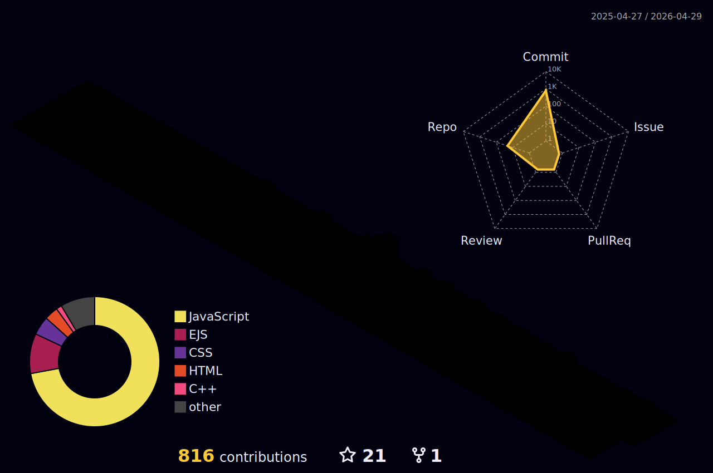

# 👋 Hey there! I'm **Anubhav Singh**

  

  

---

## 🔥 About Me  

💡 Passionate about building **secure, scalable and impactful tech solutions.**  
I love solving real-world problems with code and continuously sharpening my engineering mindset.

- 🧪 Currently Building: **PhishShield** (Cybersecurity AI Tool) & **KashiRoute** (Travel Tech Platform)
- 📚 Learning: **System Design, Web Security, Blockchain**
- 🧠 Focus Areas: **Performance, Security & User Experience**
- 💼 Open to: **Freelance, Internships & Full-Time Roles**
- 📫 Email: **anubhavsingh2027@gmail.com**
- 🌍 Portfolio: **https://anubhav.nav-code.com**

---

## 🚀 Featured Projects  

| Project | Live Demo | Description |
|--------|-----------|-------------|
| 🛡 **PhishShield** | https://phishshield.nav-code.com | AI-powered phishing detection & cybersecurity tool |
| 🌍 **KashiRoute** | https://kashiroute.nav-code.com | Travel booking platform for trips originating from Kashi |
| ⚡ **Realtime Chat App** | https://real-time-chatting.nav-code.com | Secure live chat built with WebSockets |

> 🔎 More projects available in my pinned repositories.

---

## 🛠 Tech Stack & Tools  

  

---

## 📊 GitHub Analytics  

  

  

  

---

## 🎲 3D Contribution Graph  

  

---

## 🤝 Connect With Me  

  
  
  
  

---

## ✨ Interests  

- Full Stack Product Engineering  
- Cybersecurity & Ethical Development  
- Competitive Programming  
- System Architecture & DevOps  
- Blockchain & Future Web Technology  

---

  

---

### ⭐ If you enjoy my work, consider **starring my repositories** — let's build something great together! 🚀
